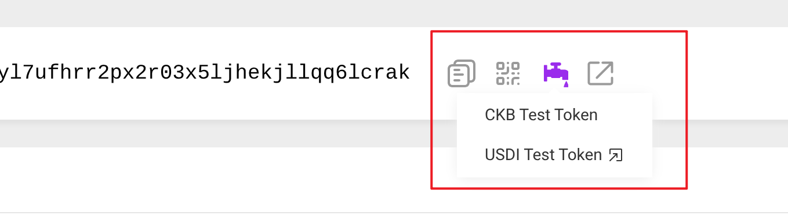

# ACP-SDK

ACP SDK is a toolkit that helps developers interact with the Anyone-Can-Pay (ACP) lock script on Nervos CKB. This SDK simplifies creating ACP cells and managing token transfers to and from ACP addresses.

> ⚠️ **Note:** This project is under active development. APIs and functions may change in future releases.

## Table of Contents
- [ACP-SDK](#acp-sdk)
  - [Table of Contents](#table-of-contents)
  - [Overview](#overview)
    - [ACP Lock Script Structure](#acp-lock-script-structure)
  - [Getting Started with Examples](#getting-started-with-examples)
    - [1. Generate Your CKB Address and Obtain Tokens](#1-generate-your-ckb-address-and-obtain-tokens)
    - [2. Create ACP Cells](#2-create-acp-cells)
    - [3. Deposit USDIs to Your ACP Address](#3-deposit-usdis-to-your-acp-address)
    - [4. Transfer USDIs Between ACP Addresses](#4-transfer-usdis-between-acp-addresses)
    - [5. Withdraw All USDIs to a Non-ACP Address](#5-withdraw-all-usdis-to-a-non-acp-address)

## Overview

The ACP (Anyone-Can-Pay) lock extends the standard `secp256k1-blake2b-sighash-all` lock with enhanced functionality. It can be unlocked through:
- Regular signature validation
- Accepting payments of any amount

This powerful feature allows users to send any amount of CKBytes or UDTs to a cell using the ACP lock without creating a new cell each time.

### ACP Lock Script Structure

```yaml
Lock Script:
    code_hash: anyone-can-pay lock
    args: <20 byte blake160 secp256k1 public key hash>
```

## Getting Started with Examples

### 1. Generate Your CKB Address and Obtain Tokens

1. **Generate a secp256k1 private key**:
   ```shell
   openssl rand -hex 32
   ```

2. **Setup environment variables**:
   ```shell
   cp .env.example .env
   ```
   Then add your generated private key to the `.env` file by updating the `EXAMPLE_CKB_SECP256K1_PRIVATE_KEY` value.

3. **Generate addresses**:
   ```shell  
   pnpm generateAddress
   ```
   This will generate both your default secp256k1 address and ACP address.

4. **Obtain test tokens**:
   - Visit the testnet explorer: https://testnet.explorer.nervos.org/address/{ckb-secp256k1-address}
   - Request CKB and USDI tokens from the faucet
   
   

Once completed, you'll have CKB and USDI tokens in your default secp256k1 address.

### 2. Create ACP Cells

**You can change the ACP public key(`acpPublicKey` in `examples/createAcpCells.ts`) to create ACP cells for other accounts.**

Use your private key and default secp256k1 address to create one or more ACP cells.

Set the desired number of cells by modifying the `count` parameter in `examples/createAcpCells.ts` and run the following command in your terminal:

```shell
pnpm createAcpCells
```
The example Testnet transaction is [here](https://testnet.explorer.nervos.org/transaction/0xb83fbc130a2f16c5c4070905894da4dfbfe8fcf15897902f742ad19f82087186).

```yaml
Inputs:
    Normal Cell:
        Capacity: N CKBytes
        Lock:
            code_hash: secp256k1_blake2b lock
            args: <public key hash A>
Outputs:
    Anyone-can-pay Cell:
        Capacity: 144.01 CKBytes
        Type: USDI type script
        Lock:
            code_hash: anyone-can-pay lock
            args: <public key hash A>
        Data:
            Amount: 0 USDI
    Change Cell:
        Capacity: (N - 144.01 - fee) CKBytes
        Lock:
            code_hash: secp256k1_blake2b lock
            args: <public key hash A>
Witnesses:
    <valid signature for public key hash A>
```

### 3. Deposit USDIs to Your ACP Address

> **Important:** Make sure at least one ACP cell exists before transferring to a new ACP address.

This step transfers USDIs from your secp256k1 address to your ACP address (automatically generated with `EXAMPLE_CKB_SECP256K1_PRIVATE_KEY` in the example).

To deposit:
1. Open `examples/depositToAcp.ts` 
2. Set your desired amount in the `usdiAmount` parameter
3. Run the following command:

```shell
pnpm depositToAcp
```
The example Testnet transaction is [here](https://testnet.explorer.nervos.org/transaction/0xf339e314ee292351a9d27bfbd768ab266d28106405518e224e57701fb67a5898).

```yaml
Inputs:
    Normal Cell:
        Capacity: N1 CKBytes
        Lock:
            code_hash: secp256k1_blake2b lock
            args: <public key hash A>
    Normal USDI Cell:
        Capacity: N2 CKBytes
        Type: USDI type script
        Lock:
            code_hash: secp256k1_blake2b lock
            args: <public key hash A>
        Data:
            Amount: M USDI
    Anyone-can-pay Cell:
        Capacity: 144.01 CKBytes
        Type: USDI type script
        Lock:
            code_hash: anyone-can-pay lock
            args: <public key hash A>
        Data:
            Amount: 0 USDI
Outputs:
    Anyone-can-pay Cell:
        Capacity: 144.01 CKBytes
        Type: USDI type script
        Lock:
            code_hash: anyone-can-pay lock
            args: <public key hash A>
        Data:
            Amount: K USDI
    Change Cell:
        Capacity: (N1 + N2 - 144.01 - fee) CKBytes
        Type: USDI type script
        Lock:
            code_hash: secp256k1_blake2b lock
            args: <public key hash A>
        Data:
            Amount: (M - K) USDI
Witnesses:
    <valid signature for public key hash A>
```

### 4. Transfer USDIs Between ACP Addresses

Transfer some USDIs to another ACP address (another ACP address has been set in the example) from your ACP address.

Set a number you want to the `usdiAmount` and the `toAcpAddress` of the `examples/transferFromAcpToAcp.ts` and run the following command in your terminal:

```shell
pnpm transferFromAcpToAcp
```
The example Testnet transaction is [here](https://testnet.explorer.nervos.org/transaction/0xfac001b8e99c8ca5bb2ac47cf58d61ce41b6efb7a4206f1fc7c3c0d964c63275).

```yaml
Inputs:
    Anyone-can-pay Cell:
        Capacity: 144.01 CKBytes
        Type: USDI type script
        Lock:
            code_hash: anyone-can-pay lock
            args: <public key hash A>
        Data:
            Amount: M USDI
    Anyone-can-pay Cell:
        Capacity: 144.01 CKBytes
        Type: USDI type script
        Lock:
            code_hash: anyone-can-pay lock
            args: <public key hash B>
        Data:
            Amount: S USDI
Outputs:
    Anyone-can-pay Cell:
        Capacity: 144.01 CKBytes
        Type: USDI type script
        Lock:
            code_hash: anyone-can-pay lock
            args: <public key hash B>
        Data:
            Amount: (S + K) USDI
    Anyone-can-pay Change Cell:
        Capacity: (144.01 - fee) CKBytes
        Type: USDI type script
        Lock:
            code_hash: anyone-can-pay lock
            args: <public key hash A>
        Data:
            Amount: (M - K) USDI
Witnesses:
    <valid signature for public key hash A>
```

### 5. Withdraw All USDIs to a Non-ACP Address

Transfer all your USDIs to a non-ACP address (A JoyID address has been set in the example) from your ACP address and your ACP cells will be destroyed.

Set a CKB address you want to the `toNonAcpAddress` of the `examples/withdrawAllFromAcp.ts` and run the following command in your terminal:

```shell
pnpm withdrawAllFromAcp
```
The example Testnet transaction is [here](https://testnet.explorer.nervos.org/transaction/0x3783990067189a8a891dba7fe975df1599d77a6c81abfb4b8964beb9a334acdd).

```yaml
Inputs:
    Anyone-can-pay Cell:
        Capacity: 144.01 CKBytes
        Type: USDI type script
        Lock:
            code_hash: anyone-can-pay lock
            args: <public key hash A>
        Data:
            Amount: M USDI
Outputs:
    Non-ACP Cell:
        Capacity: (144.01 - fee) CKBytes
        Type: USDI type script
        Lock: JoyID lock
        Data:
            Amount: M USDI
Witnesses:
    <valid signature for public key hash A>
```
